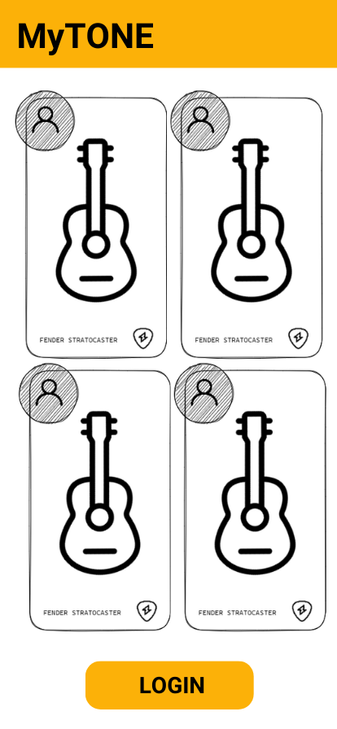
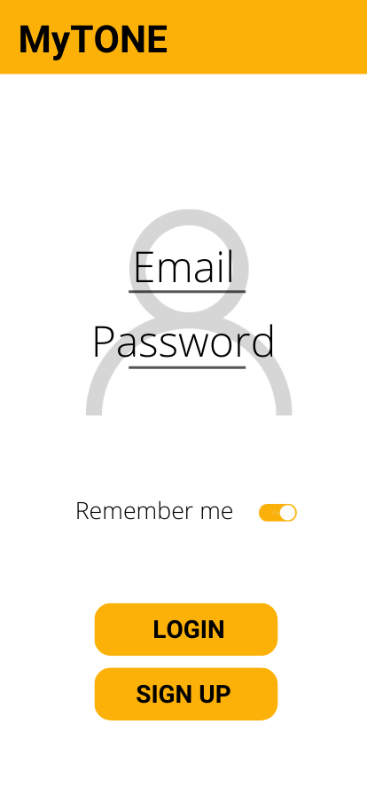
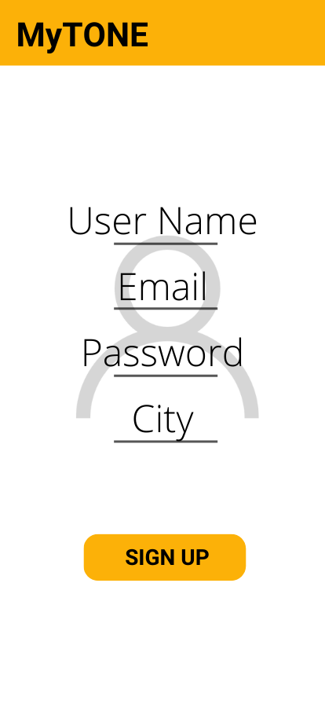
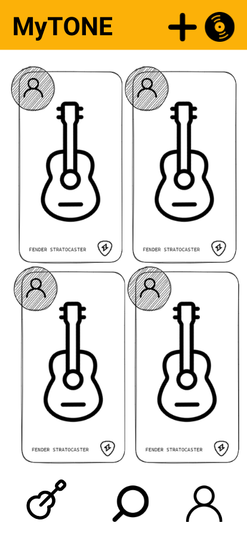

# MyTONE
<em>The gear enthusiast suite</em>

## Description

MyTone is a social network for guitarists and bassists (expandable to any collectible item or hobby objects) where you can share your instruments and interact with other users and their dream gears.

You can register and "upload" your instruments. Explain their details, characteristics, modifications and add some photos.
    
In parallel, you can interact with other users by commenting and sending "like" to the other instruments, generating a network full of reviews, photos and characteristics of guitars and basses.

---

## Instructions

When cloning the project, change the <code>sample.env</code> for an <code>.env</code> with the values you consider:
```js
PORT=3000
MONGO_URL='mongodb://localhost:27017/app-name'
SESSION_SECRET='SecretOfYourOwnChoosing'
NODE_ENV='development'
```
Then, run:
```bash
npm install
```
To start the project run:
```bash
npm run start
```

To work on the project and have it listen for changes:
```bash
npm run dev
```

---

## Wireframes
Substitute this image with an image of your own app wireframes or designs

<!-- >


 -->
---

## User stories (MVP)

What can the user do with the app?
- User can sign up and create and account
- User can login
- User can log out
- User can create Instrument
- User can edit Instrument
- User can delete Instrument
- User can send Like to other instruments
- User can comment instruments

## User stories (Backlog)

- User can upload a profile picture
- User can mark as stoled his instruments
- User can mark as "for sale" his instruments
- User can follow other users
- User can chat with other users


---

## Models

User:

```js
const userSchema = new Schema(
  {
    username: {
      type: String,
      trim: true,
      required: [true, 'Username is required.'],
      unique: true
    },
    email: {
      type: String,
      required: [true, 'Email is required.'],
      unique: true,
      lowercase: true,
      trim: true
    },
    hashedPassword: {
      type: String,
      required: [true, 'Password is required.']
    }
  },
  {
    timestamps: true
  }
);
```

---

## Routes

| Name  | Method | Endpoint    | Protected | Req.body            | Redirects |
|-------|--------|-------------|------|---------------------|-----------|
| Home  | GET   | /           | No   |                     |           |
| Login | GET    | /auth/login | No |                      |           |
| Login | POST | /auth/login   | No | { email, password }  | /         |
| Signup | GET    | /auth/signup | No |                      |           |
| Signup | POST | /auth/signup   | No | { username, email, password }  | /auth/login  |
| New movie  | GET    | /movies/new | Yes |                      |           |
| New movie | POST | /movies/new   | Yes | { title, cast, genre }  | /movies/:movieId   |

---

## Useful links

- [Github Repo]()
- [Trello kanban]()
- [Deployed version]()
- [Presentation slides](https://www.slides.com)


